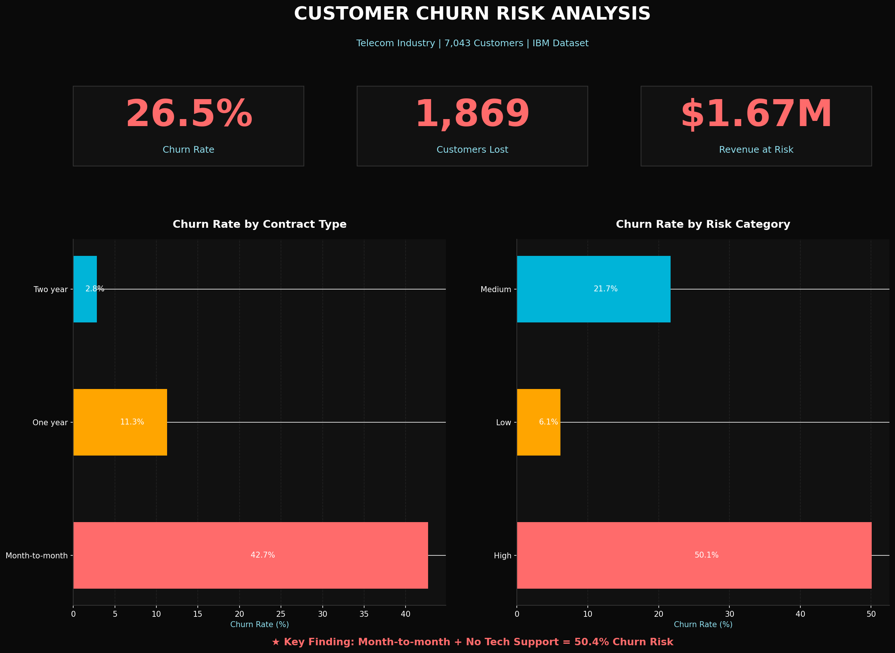
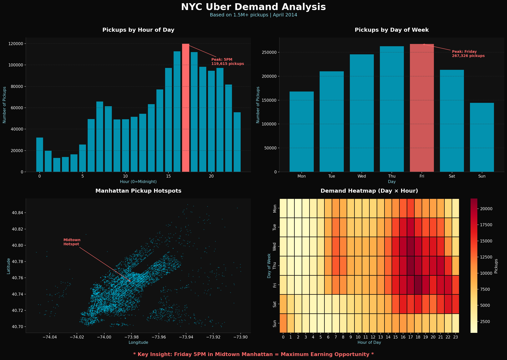

# 📊 Data Analytics Portfolio — Hithesh Raj Pesaramelli

  
  
  
  
  
  

  
  
  

---

> **MS Computer Science @ Florida Atlantic University | GPA: 3.87 | Dean's List**  
> I build end-to-end analytics projects — raw data → executive dashboards — with every finding tied to a real dollar value.

| 💰 $1.67M revenue at risk identified | 📉 $156K in losses uncovered | 🚕 1.5M+ records processed |
|:---:|:---:|:---:|

---

## 📂 Projects

---

### 1. 🔴 Customer Churn Risk Analysis
**`Python` `Pandas` `Matplotlib` `Seaborn` `EDA` `Risk Scoring`**

> A telecom company is losing **26.5% of customers annually** — $1.67M in revenue at risk. I built an end-to-end analysis and a custom risk scoring engine to identify who's about to leave and why.

#### 📌 Key Findings

| Metric | Value |
|--------|-------|
| Overall churn rate | **26.5%** (1,869 of 7,043 customers) |
| Revenue at risk annually | **$1.67M** |
| Month-to-month contract churn | **42.7%** vs. 2.8% for 2-year contracts |
| Churn rate difference | **15x gap** between contract types |
| High-risk customers identified | **2,735** (score 70–100) |
| High vs low risk churn rate | High-risk churns at **8x** the rate of low-risk |

#### 🛠 What I Built
- **Custom 0–100 Risk Scoring System** using weighted churn indicators (contract type, tenure, tech support, billing method)
- **3-tier customer segmentation** — High / Medium / Low risk — across all 7,043 customers
- **Executive KPI dashboard** with dark-theme visualizations showing churn rate, customers lost, and revenue at risk
- **3 data-driven retention strategies** projected to save **$500K+ annually**

#### 📊 Dashboard Preview

#### 💡 Business Recommendations
1. **Target month-to-month customers** with 1-year contract upgrade incentives — highest ROI retention action
2. **Prioritize tech support outreach** to customers without it — 41.6% churn rate vs. 14.7% with support
3. **Auto-pay enrollment campaign** — electronic billing customers churn at 33% vs. 16% for auto-pay

📁 `Customer_Churn_Project.ipynb`

---

### 2. 🟡 NYC Uber Demand Analysis
**`Python` `Pandas` `Matplotlib` `Seaborn` `Time Series` `Geospatial Analysis`**

> Analyzed **1.5M+ Uber pickup records** across New York City to find when and where demand peaks — delivering actionable intelligence for driver positioning strategy.

#### 📌 Key Findings

| Metric | Value |
|--------|-------|
| Total records analyzed | **1.5M+ pickups** |
| Peak demand hour | **Friday 5PM — 119,615 pickups** |
| Peak vs slowest hour | **9.2x higher** than 2AM (slowest) |
| Highest-density zone | **Midtown Manhattan** |
| Features engineered | **4** datetime features from raw timestamps |

#### 🛠 What I Built
- **4 engineered datetime features** from raw timestamp column (hour, day, weekday, month)
- **Day-by-hour demand heatmap** — 7×24 grid showing exactly when to position drivers
- **Manhattan GPS scatter map** built from raw lat/long coordinates — no mapping library used
- **Time series trend analysis** identifying weekly and monthly demand patterns

#### 📊 Dashboard Preview

#### 💡 Business Recommendations
1. **Surge Friday 5–7PM Midtown** — highest ROI driver deployment window across the entire dataset
2. **Reduce fleet on Tuesday/Wednesday 1–4AM** — lowest demand across all weeks
3. **Pre-position JFK/LGA corridor** on Sunday evenings — consistent return-travel spike

📁 `NYC_Taxi_Revenue_Analysis.ipynb`

---

### 3. 🟢 Superstore Executive Dashboard
**`SQL` `Tableau` `Excel` `Window Functions` `KPI Reporting`**

> Analyzed 10,000+ retail transactions across 4 US regions using SQL to find where the business is losing money — and built an executive Tableau dashboard to present findings.

#### 📌 Key Findings

| Metric | Value |
|--------|-------|
| Total transactions analyzed | **10,000+** across 4 regions |
| Hidden losses uncovered | **$156,131** |
| Unprofitable orders | **1,936 orders (19.4% of all orders)** |
| Worst performing segment | **Furniture / Central region: –$2,871** |
| Root cause | **Excessive discounting** driving negative margin |

#### 🛠 What I Built
- **SQL analysis** using joins, aggregations, GROUP BY, and window functions across 4 regional datasets
- **4-chart Tableau dashboard** — geographic profit map, sales trend line, category bar chart, discount impact scatter
- **Excel validation** with pivot tables, SUMIF/COUNTIF, and conditional formatting to cross-check all SQL findings
- **Process improvement recommendations** with projected revenue recovery impact

#### 🔗 [View Live Tableau Dashboard →](https://public.tableau.com/shared/BXXSS3Z3D)

#### 💡 Business Recommendations
1. **Cap discounts at 20% for Furniture in Central** — current discounts reaching 40–80% are the primary loss driver
2. **Audit Technology category pricing** in South region — strong sales but compressed margins
3. **Replicate West region strategy** in Central — identical product mix, significantly better profitability

---

## 🛠 Tech Stack

| Category | Tools |
|----------|-------|
| **Languages** | Python, SQL |
| **Analysis** | Pandas, NumPy, EDA, KPI Analysis, Risk Scoring, Time Series, Geospatial, A/B Testing |
| **Visualization** | Tableau, Power BI, Matplotlib, Seaborn |
| **Databases** | MySQL, SQLite |
| **Excel** | Pivot Tables, VLOOKUP/XLOOKUP, SUMIFS, COUNTIF, Conditional Formatting |
| **Concepts** | Business Intelligence, Stakeholder Reporting, Data Storytelling, Process Improvement |

---

## 👤 About Me

**MS in Computer Science** — Florida Atlantic University | GPA: 3.87 | Dean's List | May 2026  
🇺🇸 **Authorized to work in the US** — F-1 STEM OPT through July 2028 (no sponsorship required)  
📍 Delray Beach, FL  

**Open to:** Data Analyst · Business Intelligence Analyst · Analytics Engineer · Reporting Analyst

 
